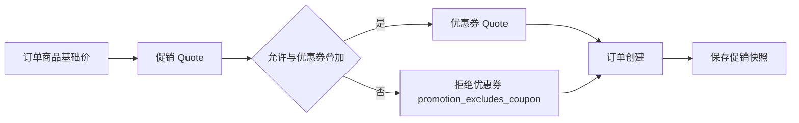
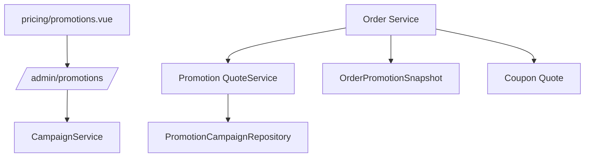

# 促销规则引擎使用指南

## 背景

促销规则引擎位于基础价和优惠券之间：

```text
pricebook 基础价 -> promotion 自动促销 -> coupon 用户券 -> payable 应付金额
```

一期支持订单级满减和折扣，覆盖管理端配置、订单试算、与优惠券叠加/互斥、订单促销快照。

## 管理端流程

1. 打开 `定价中心 / 促销规则`。
2. 新建促销，填写编码、名称、类型、有效期、范围、门槛、优惠动作和叠加规则。
3. 保存草稿或保存并启用。
4. 在列表按关键词、类型、状态、渠道筛选。
5. 对规则执行启用、停用、复制和审计查询。

## 交易流程



## 模块关系



## 接口

- `GET /api/v1/admin/promotions`
- `POST /api/v1/admin/promotions`
- `PATCH /api/v1/admin/promotions/:id`
- `POST /api/v1/admin/promotions/:id/activate`
- `POST /api/v1/admin/promotions/:id/pause`
- `POST /api/v1/admin/promotions/:id/clone`
- `GET /api/v1/admin/promotions/:id/audit-logs`
- `POST /v1/promotions/quote`

## 验证

```bash
cd backend
GOCACHE=$PWD/../tmp/gocache GOMODCACHE=$PWD/../tmp/gomodcache go test ./internal/services/admin/promotion ./internal/transport/http/admin/promotion ./internal/transport/http/miniapp/promotion ./internal/services/admin/order

cd ../web-admin
npm run -s build
```

## 排障

- 促销未命中：检查 `status`、有效期、渠道、SKU 范围和订单金额门槛。
- 优惠券被拒绝：检查促销规则 `stackable_with_coupon=false`，拒绝原因应为 `promotion_excludes_coupon`。
- 历史金额变化：订单详情应读取 `order_promotion_snapshots`，不能重新计算历史促销。
